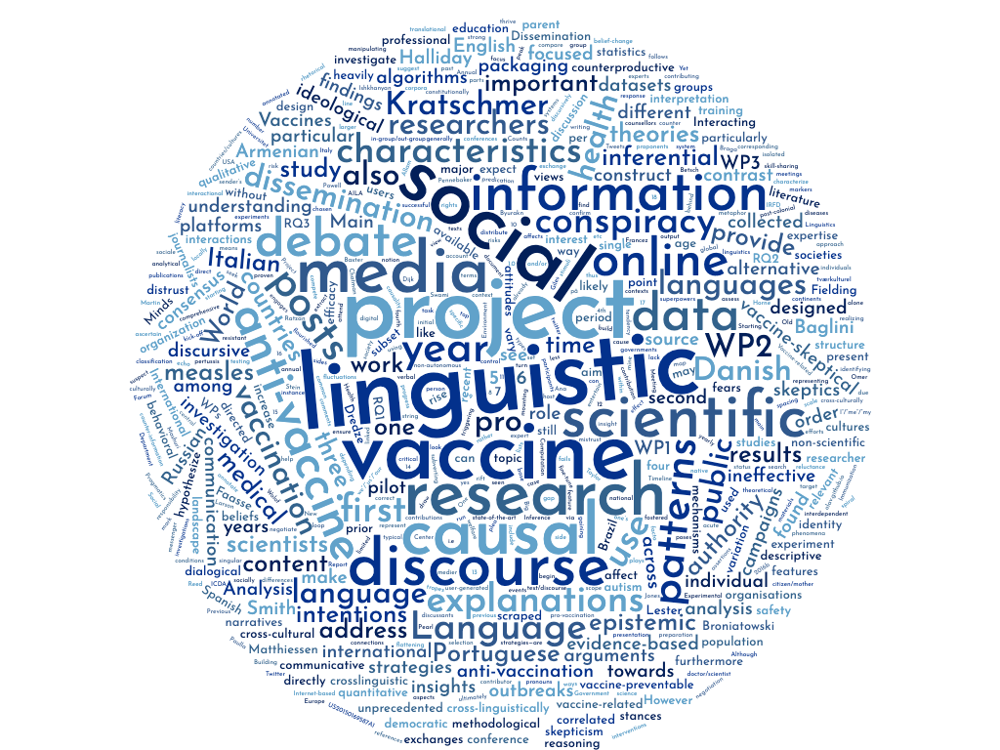

OLaV: Online Language of Vaccines at Aarhus University 
============

Follow us on [Twitter!]( 

The team
---------------------

|  Members         | Position        | Dept|
|-----------|---------------|--------|
| Alexndra Kratschmer| Professor   | Linguistics | 
| Rebekah Baglini | Postdoc | Linguistics | 
| Byurakn Ishkhanyan | Postdoc | Linguistics | 
| Ana Paulla Braga Mattos | PhD | Linguistics | 

Project overview 
---------------

Output
--------------

### Assignments 

You will have a number of group programming assignments to complete in weeks .... 

Use Github classroom to upload your assignments. You will receive an email invitation to register in week 36. 

### Assessment/Academic goals 
In the evaluation of the student's performance, emphasis is placed on the extent to which the student is able to:

**Knowledge**: 
- contrast different natural language processing methods in terms of their strengths and weaknesses in different use contexts 
- explain how formal analysis of natural language can provide insights into human cognition and behavior 
- discuss ethical and philosophical issues related to natural language processing software and technology .

**Skills**: 
- identify relevant data sources for specific research and applied questions 
- correctly choose and apply tools for analyzing natural language data.

**Competencies**: 
- critically reflect on and discuss theoretical and empirical implications of using natural language processing techniques 
- justify the choice between relevant methods and analyzes used for specific research questions within the field of natural language processing 
- clear oral presentation of complex analyzes.

### Preparing project for your final exam

Start thinking about your final project idea as early as possible. If you would like to do a group assignment (*highly recommended*) you will have the opportunity to present a brief **project pitch** in week 43 (October 23) where you can recruit collaborators, or join someone else's cool project! 

### Final exam details  
Note: Oral exams will take place between January 20-24, 2020. 

The exam is an individual oral exam based on a written synopsis. The duration is 30 minutes including the student's presentation of the synopsis project, followed by dialogue with the examiners and assessment. 

The synopsis can be done as an individual or group assignment. If it is done as a group assignment, the final product must 

(i) form a coherent text and 
(ii) be organized so that it is possible to make individual assessments of the students contributing. 

In other words, the contribution of each individual student to the whole assignment must be clearly delineated (excluding the introduction, conclusion and bibliography). 

A maximum of three students can take part in a group assignment.
- Length of individual synopsis: 4-7 standard pages (not including code and figures) 
- Length of synopsis for 2 students: 8-14 standard pages per student (not including code and figures) 
- Length of synopsis for 3 students: 12-21 standard pages per student (not including code and figures)
