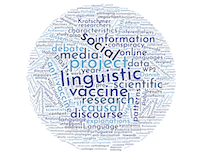

 OLaV: Online Language of Vaccines
============

Follow us on [Twitter!](https://twitter.com/OLaV_AU) 

The team
---------------------

|  Members         | Position        | Dept|
|-----------|---------------|--------|
| Alexndra Kratschmer| Professor   | Linguistics | 
| Rebekah Baglini | Postdoc | Linguistics | 
| Byurakn Ishkhanyan | Postdoc | Linguistics | 
| Ana Paulla Braga Mattos | PhD | Linguistics | 

Project overview 
---------------
Although there is scientific consensus for the safety and efficacy of modern vaccines (CDC: Department of Immunization Safety), recent outbreaks of vaccine-preventable diseases like measles and pertussis in parts of Brazil, the United States and Europe (WHO, 2017) indicate that vaccine skepticism is one the rise and poses an acute risk to public health (Dredze, Broniatowski, Smith, & Hilyard, 2016b; Phadke, Bednarczyk, Salmon, & Omer, 2016). Vaccine-related fears appear to thrive on social media platforms, where non-scientific information is transmitted “horizontally” among like-minded users within ideological echo-chambers (Larson, Cooper, Eskola, Katz, & Ratzan, 2011). Yet prior work on the content of vaccine-skeptical (VS) social media posts is limited to descriptive statistics (Faasse, Chatman, & Martin, 2016; Mitra, Counts, & Pennebaker, 2016), and fails to address deeper inferential, linguistic, and discursive properties. The aim of this project is to provide a more comprehensive qualitative and quantitative investigation of the discourse landscape of the vaccine debate on social media on the three timely research questions: 

+ RQ1: What linguistic, discursive, and interactional patterns characterize pro- and anti-vaccine posts on social media?
+ RQ2: How do anti-vaccine proponents construct alternative causal explanations for recent vaccine-related events like global measles outbreaks?  
+ RQ3: How does the particular packaging of causal information about vaccine-preventable outbreaks affect subjects’ interpretation of the information? 

Our project will address RQ1 and RQ2 using a combination of quantitative and qualitative linguistic analysis to extract and model inferential patterns present in the language of pro- and anti-vaccine posts on social media, ultimately identifying where epistemic and ideological views diverge. By coupling these insights with behavioral studies addressing belief-change in response to the variation in the linguistic packaging of evidence-based research on vaccine efficacy and safety (RQ3), as well as variation in the identity of the messenger, our research will provide unprecedented insight into the reasoning patterns that reinforce anti-vaccine views despite mounting scientific consensus and aggressive counter-information campaigns.  

These phenomena will furthermore, for the first time, be studied cross-linguistically and cross-culturally, gaining thereby understanding of which aspects of the vaccine debate are most general and which are culturally anchored.

Output
--------------
